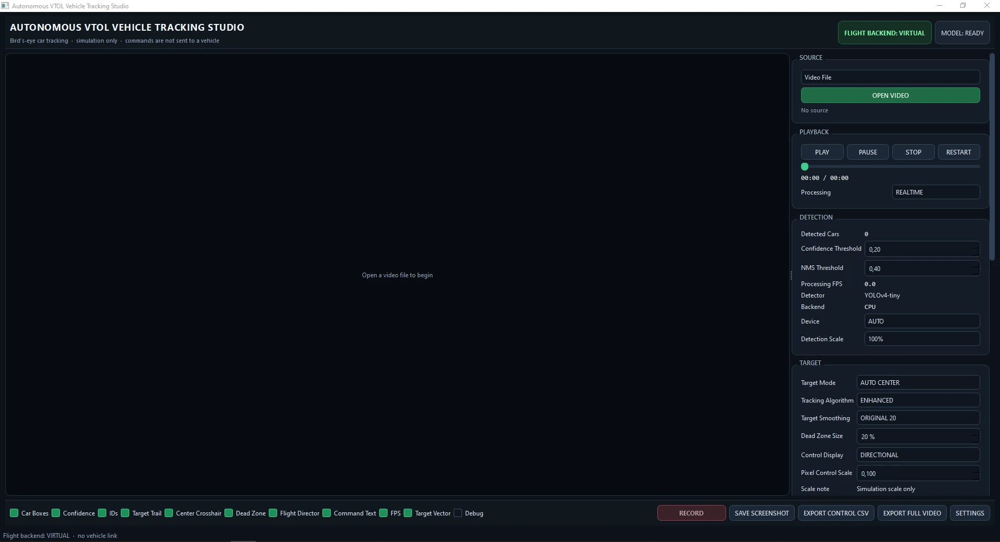
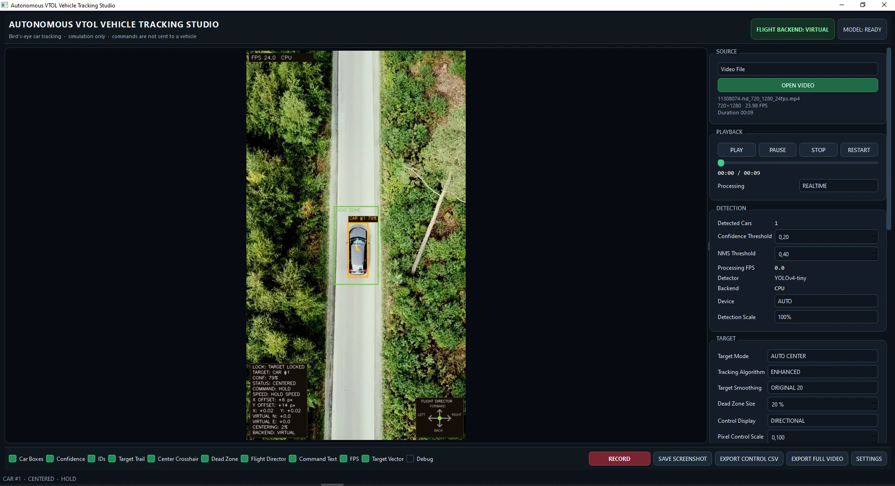
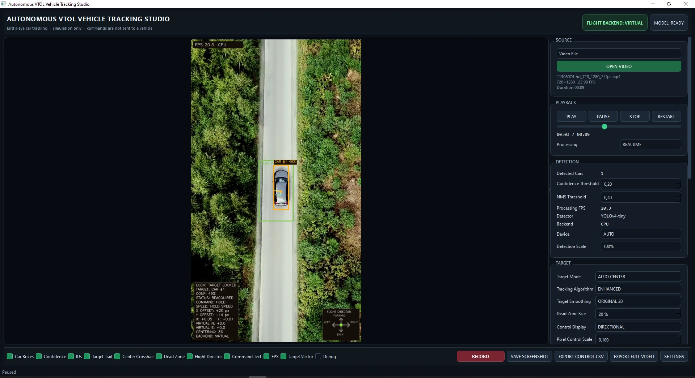
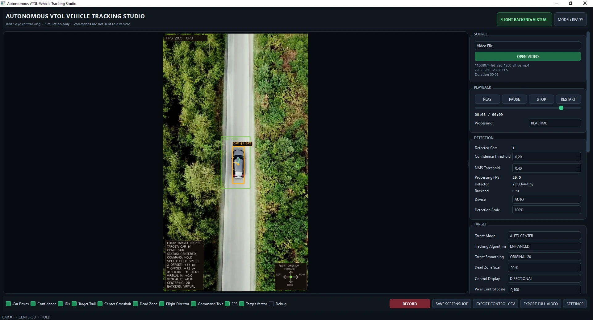
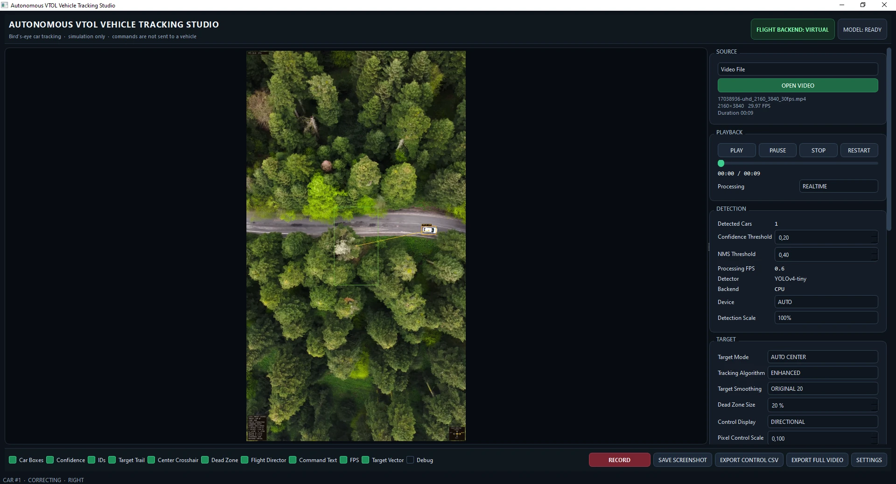
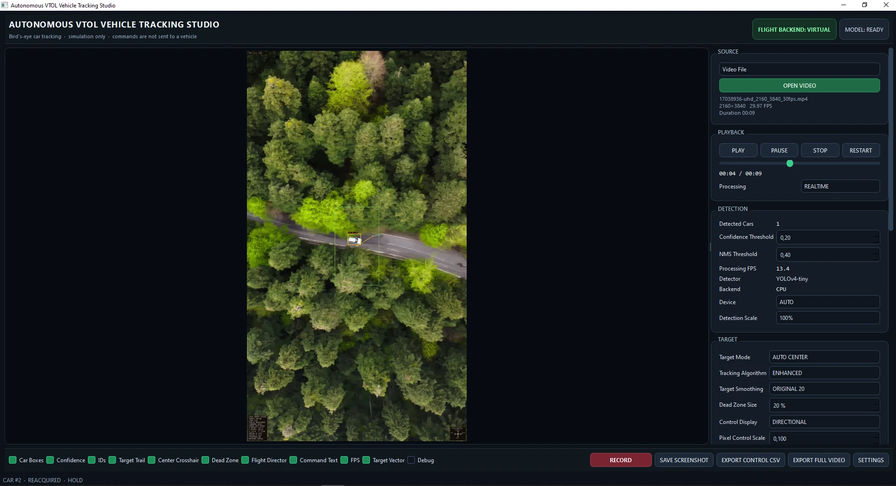
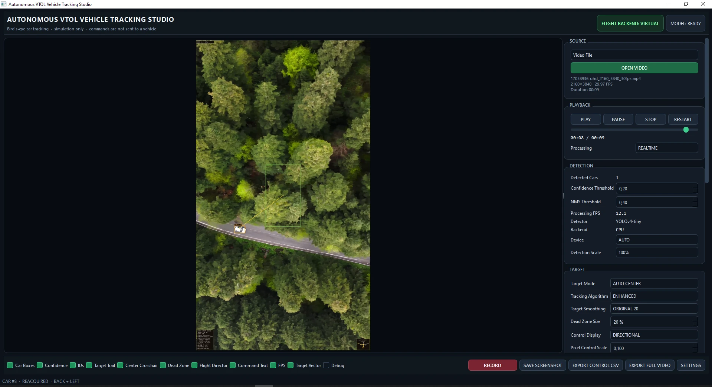
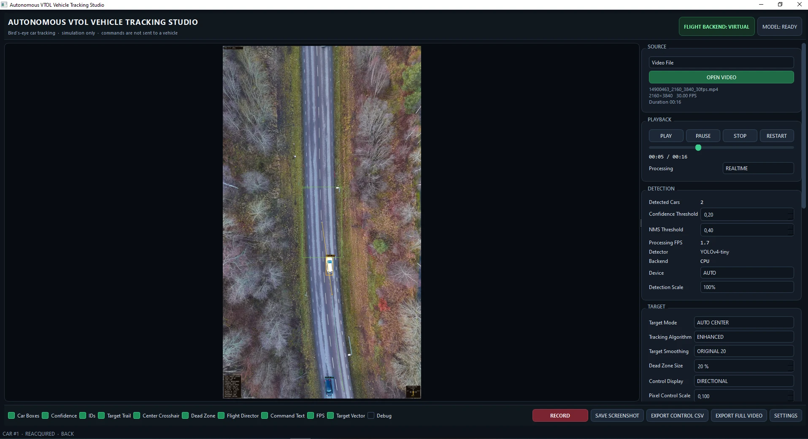
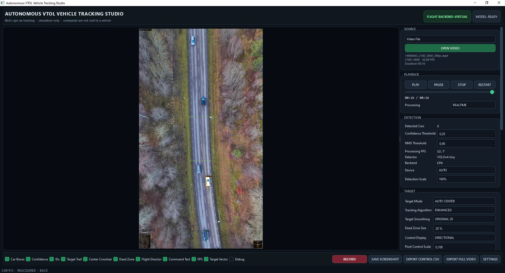
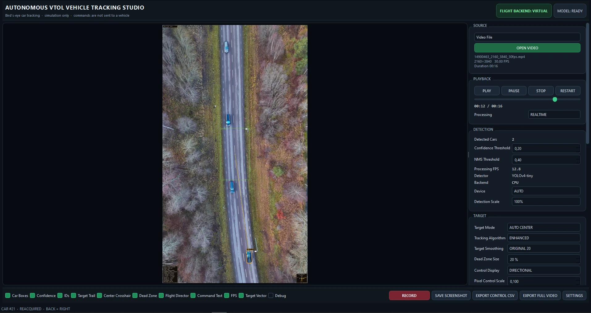

# FPV Vehicle Tracking & Visual Flight Director Studio

A local Windows computer-vision application for detecting, selecting and tracking vehicles in aerial / FPV video. The project combines a YOLOv4-tiny vehicle detector with target locking, reacquisition, motion smoothing, trajectory visualization, a virtual flight-director layer, recording and telemetry export.

> **Important:** this repository is a computer-vision and control-logic simulation. It does **not** connect to or command a real aircraft. The PX4/MAVSDK backend is intentionally disabled in this version.

## Project overview

The application was developed as a desktop engineering tool for experimenting with vehicle tracking from drone-style video. It accepts recorded video, a webcam or RTSP stream, detects cars from a bird's-eye perspective and maintains a selected target across frames.

The tracking result is converted into **virtual** guidance commands such as `LEFT`, `RIGHT`, `FORWARD`, `BACK`, `SPEED UP`, `SLOW DOWN` and `HOLD`. A simulated N/E offset can also be displayed for visualization and logging.

The program was inspired by the architecture and research direction of the public **Autonomous VTOL UAV** project by Göktuğ Gümüş and Hasan Ayberk Aydemir / Çankaya University:

https://github.com/GoktuGumus/autonomous-vtol-uav

This repository provides its own Windows desktop application layer, source management, target-selection logic, enhanced tracker, visualization, virtual control simulation, recording and export workflow.

## Screenshots

All screenshots supplied with Version 1 are included below.

### Vehicle detection and target lock







### Aerial vehicle-tracking scenes







### Road / forest tracking sequences







The clean interface shown at the top is `Screenshot_5.webp`.

## Main features

- YOLOv4-tiny vehicle detection through OpenCV DNN
- Bird's-eye / aerial-video workflow
- Video-file, webcam and RTSP input
- Automatic center-priority target selection
- Click-to-select target mode
- First-detected target mode
- Next / previous target switching
- Target loss timeout and automatic reacquisition
- Original and Enhanced tracking algorithms
- Persistent target IDs in Enhanced mode
- Moving-average smoothing
- Configurable dead zone
- Target vector from frame center to tracked vehicle
- Raw and filtered X/Y offsets
- Centering-error visualization
- Target-size trend: approaching / receding / stable
- Virtual speed command estimation
- Virtual flight-director commands
- N/E simulation output
- Detection-scale controls for performance tuning
- CPU / CUDA selection with automatic fallback
- 15-second processed-video recording
- Screenshot capture
- Full-video export
- Control/telemetry CSV export
- Runtime performance information

## Tracking modes

### ORIGINAL

The Original mode reproduces the center-offset tracking concept used by the referenced VTOL research project:

- choose the car closest to the frame center;
- smooth the target center with a 20-point moving average;
- use a central rectangular dead zone;
- convert target displacement into virtual North/East guidance values.

### ENHANCED

Enhanced mode adds application-specific tracking behavior:

- persistent IDs;
- mouse target selection;
- lost-target timeout;
- automatic reacquisition;
- target trajectory;
- target-size trend;
- speed-command heuristics.

## Target selection

The application supports three selection modes:

- **AUTO CENTER** — selects and keeps the most relevant target near the center;
- **CLICK TARGET** — the user selects a vehicle directly in the video;
- **FIRST DETECTED** — tracks the first stable vehicle detection.

Available target states include:

`SEARCHING` · `DETECTED` · `LOCKED` · `CENTERED` · `CORRECTING` · `LOST` · `REACQUIRED`

## Virtual flight director

The guidance layer converts the target offset into simulated commands:

- target above center → `FORWARD`
- target below center → `BACK`
- target left of center → `LEFT`
- target right of center → `RIGHT`
- target inside the dead zone → `HOLD`

Diagonal displacement can produce combined commands such as `FORWARD + LEFT`.

These values are **visual guidance outputs only**. They are not calibrated aircraft commands and are not sent to a flight controller.

## N/E simulation

The optional N/E view uses a center-offset mapping of the form:

```text
E = (target_x - frame_center_x) * scale
N = (frame_center_y - target_y) * scale
```

`Pixel Control Scale` is a simulation coefficient, not a real-world meters-per-pixel calibration.

## Speed and scale analysis

The application estimates simple target behavior from recent frames:

- `SPEED UP`
- `SLOW DOWN`
- `HOLD SPEED`

It also reports whether the target appears to be:

- `APPROACHING`
- `RECEDING`
- `STABLE`

These are visual heuristics, not physical speed measurements.

## Supported sources

### Video file

Supported formats include MP4, AVI, MOV and MKV. Playback controls include play, pause, stop, restart and seek.

Two processing strategies are available:

- **REALTIME** — follows source playback timing and may skip frames when inference is slower than the source;
- **EVERY FRAME** — processes every frame and may run slower than real time.

### Webcam

Common camera indices and resolutions are supported, including 640×480, 1280×720 and 1920×1080.

### RTSP

The application can connect to an RTSP source and keeps connection errors isolated from the GUI.

## Recording and export

### 15-second demo recording

`RECORD` writes exactly 15 seconds of the **processed video output**, including overlays and tracking information.

Output path:

```text
recordings/vtol_tracking_YYYYMMDD_HHMMSS.mp4
```

### Screenshots

```text
screenshots/vtol_tracking_YYYYMMDD_HHMMSS.png
```

### Full-video export

A complete video file can be processed and exported to `output/`.

### Control CSV

The telemetry/control export includes fields such as:

- timestamp;
- frame index;
- target ID;
- target position;
- X/Y offsets;
- target size;
- virtual direction command;
- virtual speed command;
- simulated N/E values;
- tracking status.

## GPU / CPU

Device modes:

- `AUTO`
- `CUDA`
- `CPU`

When a compatible OpenCV build exposes the CUDA DNN backend, the application can request CUDA / FP16 inference. Otherwise it automatically falls back to CPU.

The standard `opencv-python` PyPI package normally does not include CUDA DNN support. A CUDA-enabled OpenCV build is required for GPU inference.

## Model files

The detector expects the following files in `model/`:

```text
custom-yolov4-tiny-detector_best.weights
custom-yolov4-tiny-detector.cfg
classes.txt
```

The trained weights and upstream detector configuration are **not redistributed in this public repository**. Obtain them from the original project or another source for which you have appropriate permission, then place them in the `model/` directory.

The class file used by this application contains the single class:

```text
car
```

## Installation

Recommended environment:

- Windows 10 / 11
- Python 3.10+
- OpenCV 4.x

Run:

```bat
install.bat
```

Then:

```bat
start.bat
```

The application intentionally targets OpenCV 4.x because the Darknet importer required for `.cfg` / `.weights` is not available in the same way in OpenCV 5.

## Repository structure

```text
app/            PySide6 GUI and panels
capture/        video, webcam and RTSP sources
control/        virtual guidance and N/E simulation
detection/      YOLOv4-tiny OpenCV-DNN detector
export/         control/telemetry CSV
recording/      processed-video recording
tracking/       original and enhanced trackers
visualization/  boxes, overlays, flight director and target vector
utils/          logging, paths, timers and GPU information
tools/          installation and smoke-test utilities
model/          user-supplied detector model files
IMG/            project screenshots
```

## Safety and intended use

This project is intended for computer-vision research, simulation, engineering demonstrations and offline analysis.

Version 1 does **not** connect to Pixhawk, PX4, QGroundControl or MAVSDK and does not transmit commands to an aircraft. `PX4Backend` is a disabled placeholder only.

Real autonomous flight requires an independent safety architecture including verified flight-control logic, geofencing, failsafes, obstacle avoidance, simulation and controlled testing.

## Upstream attribution

Research / architecture reference:

**Autonomous VTOL UAV — detection, tracking and follow control**  
Göktuğ Gümüş, Hasan Ayberk Aydemir / Çankaya University  
https://github.com/GoktuGumus/autonomous-vtol-uav

At the time this repository was prepared, the referenced GitHub repository did not expose a LICENSE file. Accordingly, this project does not claim any relicensing rights over upstream code, model weights, configuration, dataset or media, and those assets are not redistributed here.

## License

The original application code in this repository is released under the **Apache License 2.0**. See [LICENSE](LICENSE).

Third-party software and externally obtained model files remain under their respective terms. See [THIRD_PARTY_LICENSES.md](THIRD_PARTY_LICENSES.md).
